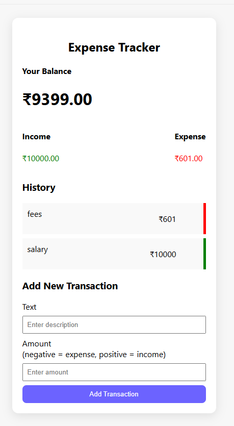

# Expense Tracker

A simple and responsive expense tracker web application built using React.

## Features
- Add income and expense transactions
- Automatically calculates balance, income, and expenses
- Delete transactions
- Data persistence using browser localStorage
- Clean and user-friendly UI

## Tech Stack
- React.js
- JavaScript
- CSS

  ## Screenshot



## How to Run Locally
```bash
npm install
npm start
